# Argus — ML Observability & Drift Detection Platform

Production-grade drift detection for deployed ML models. Built for Apple Silicon. $0 budget. Fully local.

---

## What it does

Argus ingests feature vectors and predictions from deployed ML models, detects distributional shifts using statistical tests, fires alerts when thresholds breach, and exposes drift metrics to Prometheus and Grafana. It functions as the observability layer for any ML system producing predictions.

---

## Why it matters

Model accuracy degrades silently in production. Input distributions shift. Upstream data pipelines change. Without monitoring, you discover degradation through user complaints or business metrics — too late. Argus implements the same drift detection pattern used in production ML monitoring platforms: event ingestion, statistical testing against a reference distribution, alert rules, and dashboard observability.

---

## Architecture

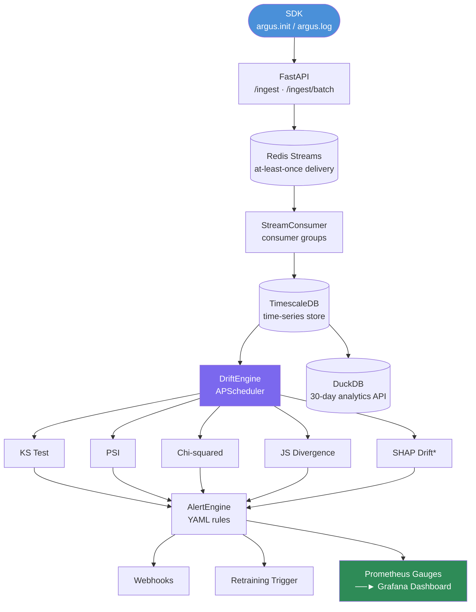

*SHAP drift: implemented; verify completeness before claiming in production demos.

---

## Features

- **REST ingestion API**: single and batch prediction logging (`/ingest`, `/ingest/batch`)
- **5 drift detection methods**: KS test, PSI (Population Stability Index), Chi-squared, Jensen-Shannon divergence, SHAP feature importance drift
- **Redis Streams ingestion pipeline**: non-blocking SDK, at-least-once delivery, consumer groups
- **TimescaleDB time-series storage**: drift scores stored with timestamps for trend analysis
- **DuckDB analytics API**: 30-day drift history queries without TimescaleDB
- **YAML alert rules**: configurable thresholds per method, per feature, per model
- **Alert actions**: webhook calls and retraining trigger signals
- **Baseline comparison**: reference distribution set via API; drift computed against it
- **Python SDK**: `argus.init()` / `argus.log()` — one-line integration
- **Prometheus metrics**: 6 drift metrics exposed for Grafana dashboards
- **Grafana dashboards**: pre-configured drift monitoring dashboard

> **Note on SHAP drift**: SHAP-based feature importance drift is listed as a supported method. Verify implementation completeness in `argus_core/drift/shap_drift.py` before presenting it as a complete feature in interviews. KS, PSI, Chi-squared, and JS divergence are fully implemented and tested.

---

## Tech Stack

Python · FastAPI · Redis Streams · TimescaleDB · DuckDB · APScheduler · Prometheus · Grafana · Docker · SciPy · SHAP

---

## Quickstart

### 1. Install dependencies

```bash
cd argus
pip install -r requirements.txt
```

### 2. Start infrastructure

```bash
cd argus
docker compose up timescaledb redis prometheus grafana -d
```

### 3. Start Argus

```bash
cd argus
uvicorn argus_core.main:app --port 8001 --reload
```

### 4. Run tests

```bash
cd argus
pytest tests/ -v
```

### 5. Run the synthetic drift demo

```bash
cd argus
python demo/synthetic_drift_demo.py
```

### Full Docker stack

```bash
cd argus
docker compose up --build
```

---

## API / CLI Usage

### SDK usage

```python
import sdk as argus

argus.init(endpoint="http://localhost:8001", model_id="my_model")

# In your prediction loop:
prediction = model.predict(features)
argus.log(features=features, prediction=prediction, label=actual)
```

### API Endpoints

| Endpoint | Method | Description |
|---|---|---|
| `/models` | POST | Register a model and define features |
| `/models/{id}/reference` | POST | Set reference distribution for drift baseline |
| `/models` | GET | List all registered models |
| `/models/{id}` | GET | Get model details |
| `/ingest` | POST | Log a single prediction |
| `/ingest/batch` | POST | Log a batch of predictions |
| `/drift/{id}/run` | POST | Trigger drift computation immediately |
| `/drift/{id}/latest` | GET | Get latest drift scores |
| `/health` | GET | Health check |
| `/metrics` | GET | Prometheus metrics |
| `/docs` | GET | Swagger interactive API docs |

### Example: Register a model and ingest predictions

```bash
# Register a model
curl -X POST http://localhost:8001/models \
  -H "Content-Type: application/json" \
  -d '{
    "model_id": "fraud_v1",
    "name": "Fraud Detector",
    "version": "1.0",
    "features": [
      {"name": "amount", "type": "numeric"},
      {"name": "merchant_type", "type": "categorical"}
    ]
  }'

# Ingest a prediction
curl -X POST http://localhost:8001/ingest \
  -H "Content-Type: application/json" \
  -d '{
    "model_id": "fraud_v1",
    "features": {"amount": 150.0, "merchant_type": "retail"},
    "prediction": 0
  }'

# Check drift scores
curl http://localhost:8001/drift/fraud_v1/latest | python -m json.tool
```

### Alert rule configuration

```yaml
# config/alert_rules.yaml
rules:
  - name: "psi_critical"
    method: "psi"
    threshold: 0.25
    operator: "gt"
    severity: "critical"
    retraining_trigger: true

  - name: "ks_warning"
    method: "ks_test"
    threshold: 0.1
    operator: "lt"
    severity: "warning"
```

Supported operators: `lt`, `gt`, `lte`, `gte`
Supported methods: `ks_test`, `psi`, `chi_squared`, `js_divergence`, `shap_drift`

---

## Tests

```bash
# Run all tests (no Redis or TimescaleDB needed — all mocked)
pytest tests/ -v

# With coverage
pytest tests/ -v --cov=argus_core
```

30+ tests covering: model registration, ingestion, drift computation (all 5 methods), alert engine, SDK, API endpoints.

---

## Observability

### Prometheus metrics (at `/metrics`)

| Metric | Description |
|--------|-------------|
| `argus_drift_score{model_id, feature_name, method}` | Drift score per feature per method |
| `argus_drift_severity{model_id, feature_name}` | Severity level (0=OK, 1=INFO, 2=WARNING, 3=CRITICAL) |
| `argus_alerts_fired_total{model_id, severity, method}` | Alert fire count |
| `argus_ingest_total{model_id, status}` | Ingestion request count |
| `argus_stream_consumer_lag` | Redis Streams consumer lag |
| `argus_uptime_seconds` | Server uptime |

### Drift severity thresholds

| Method | OK | INFO | WARNING | CRITICAL |
|---|---|---|---|---|
| KS test (p-value) | >0.2 | 0.1–0.2 | 0.05–0.1 | <0.05 |
| PSI | <0.05 | 0.05–0.1 | 0.1–0.25 | >0.25 |
| JS Divergence | <0.05 | 0.05–0.1 | 0.1–0.3 | >0.3 |
| SHAP rank corr | >0.85 | 0.7–0.85 | 0.5–0.7 | <0.5 |
| Chi-squared (p-value) | >0.1 | — | 0.05–0.1 | <0.05 |

### Grafana

- URL: http://localhost:3000
- Login: admin / argus
- Dashboard: `dashboards/argus_grafana.json`

---

## Demo

```bash
# Navigate to argus directory
cd argus

# Start Argus
uvicorn argus_core.main:app --port 8001 --reload

# Run synthetic drift simulation (auto-registers model, ingests data, triggers drift)
python demo/synthetic_drift_demo.py

# Expected: drift scores appear in Grafana, alerts fire when PSI > 0.25

# Manually trigger drift computation
curl -X POST http://localhost:8001/drift/fraud_v1/run

# View latest drift scores
curl http://localhost:8001/drift/fraud_v1/latest | python -m json.tool
```

---

## Known Limitations

- **TimescaleDB dependency**: Argus requires TimescaleDB (PostgreSQL extension) for time-series drift score storage. This is a heavier dependency than most other AI Hive projects. DuckDB analytics API provides an alternative for offline analysis.
- **SHAP drift completeness**: SHAP-based drift is listed as a supported method. Verify implementation completeness before presenting as a fully tested feature.
- **No real-time alerting**: Alert evaluation runs on a schedule (APScheduler). It is not sub-second. Alert latency depends on the configured evaluation interval.
- **Single-tenant**: Argus does not separate data between teams or users. All models share the same backend.
- **No alert deduplication**: Repeated threshold breaches fire repeated alerts. Add deduplication logic before connecting to PagerDuty or Slack.
- **Reference distribution required**: Drift scores are meaningless without a reference distribution. You must call `/models/{id}/reference` before drift detection produces results.

---

## Future Work

- Add alert deduplication and notification channels (Slack, PagerDuty)
- Replace TimescaleDB with DuckDB for a lighter deployment (single-container)
- Add online drift monitoring (streaming detection, not just batch)
- Add data quality checks (null rates, type mismatches)
- Multi-tenant model registry with API key auth

---

## Resume Bullet

> Built an ML observability platform for monitoring model health and feature drift using statistical drift tests (KS, PSI, JS divergence), event-driven ingestion via Redis Streams, historical analytics, and Prometheus/Grafana dashboards.

##Screenshots
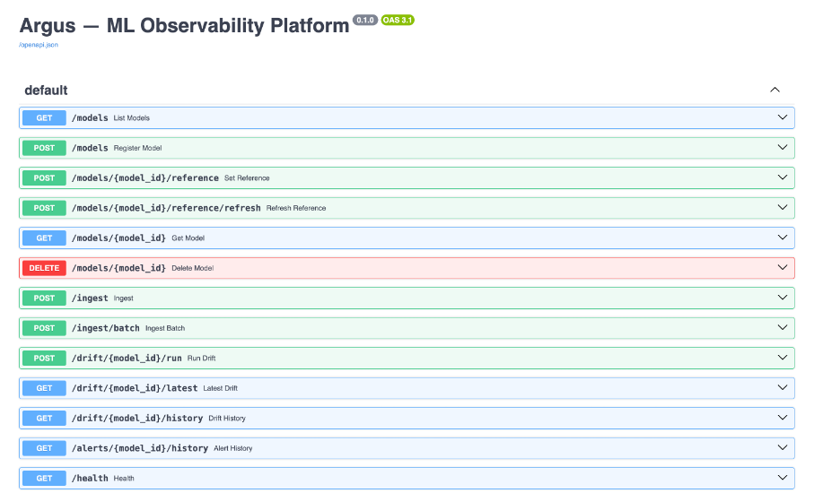
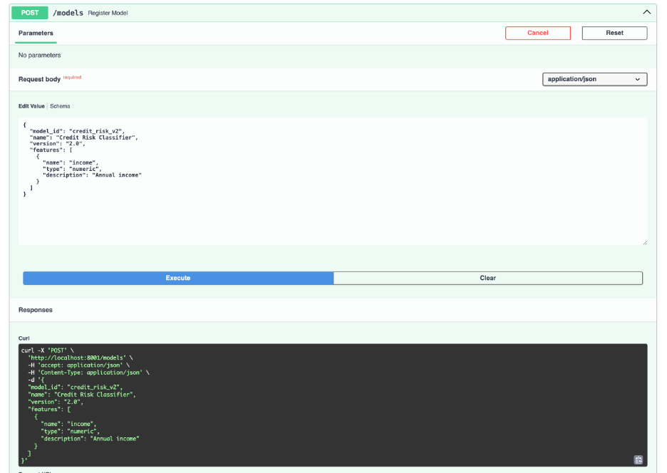
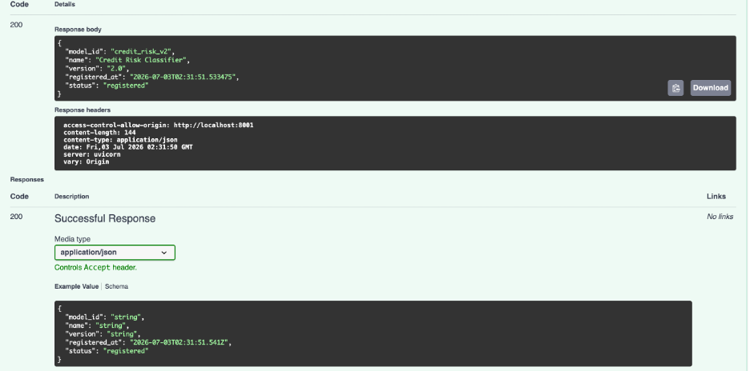
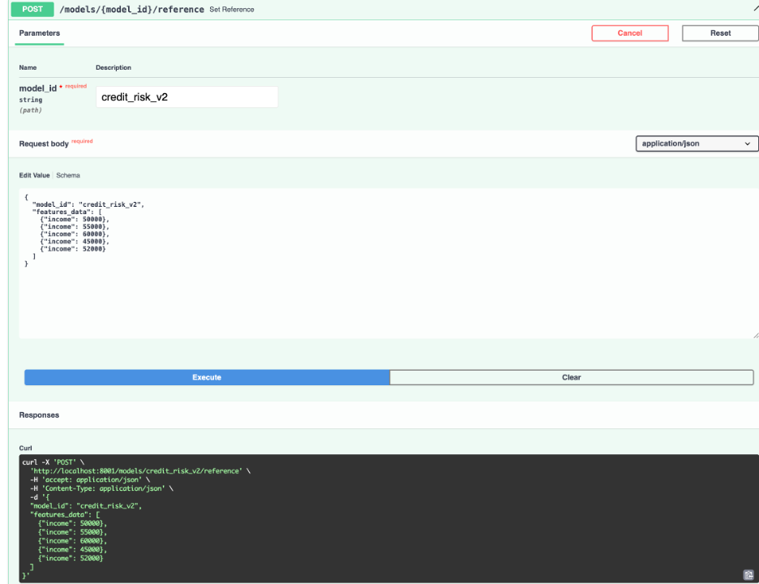
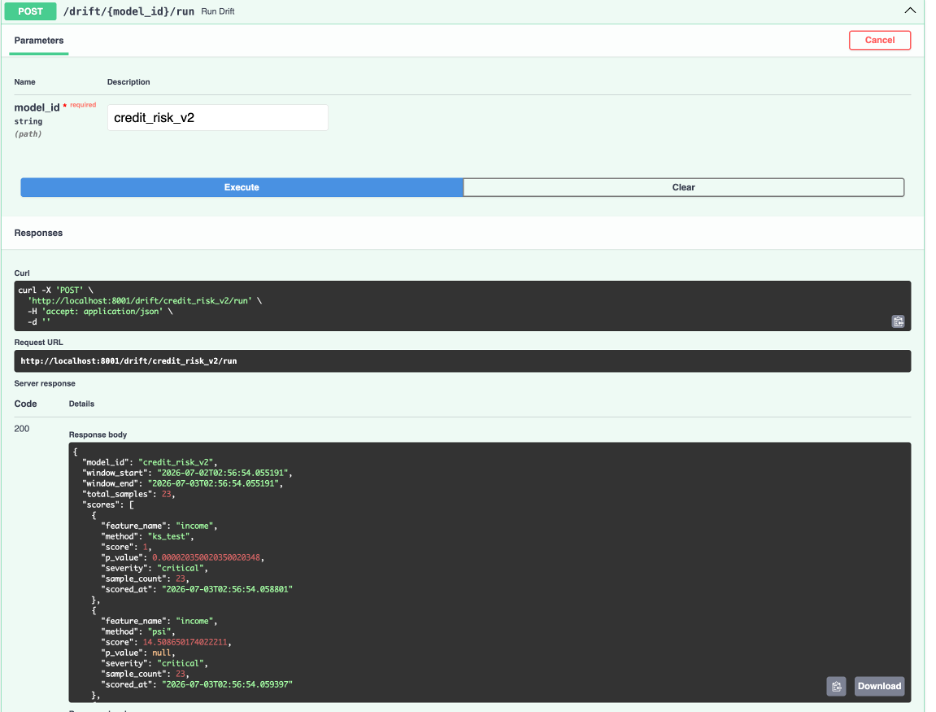
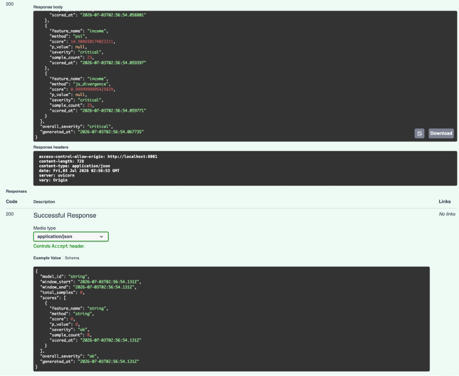
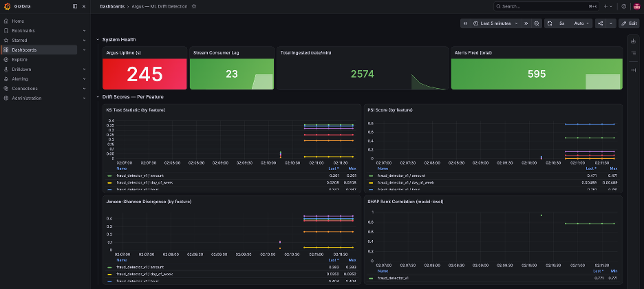
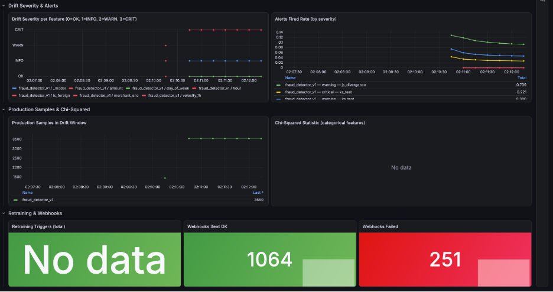
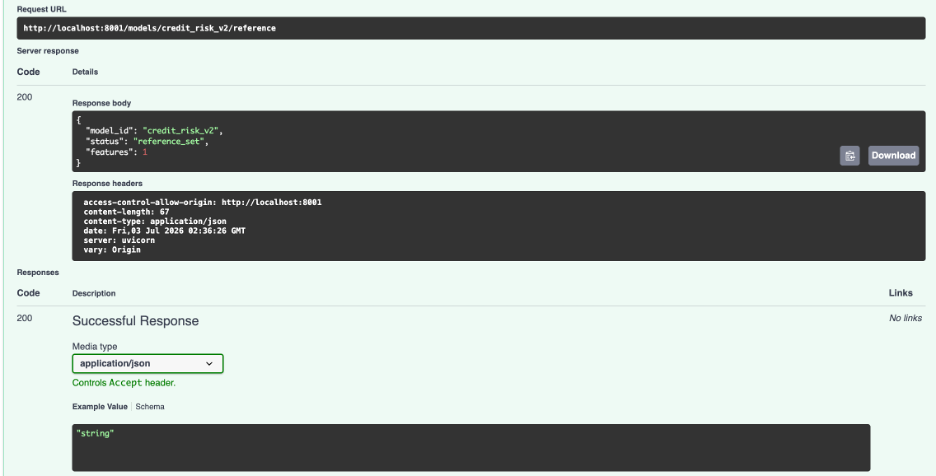
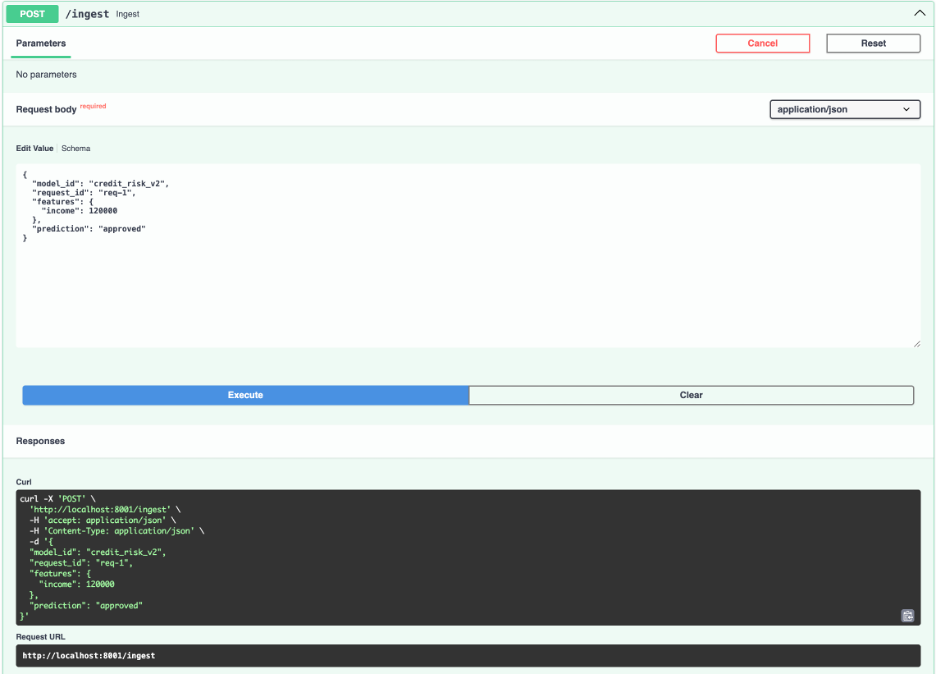
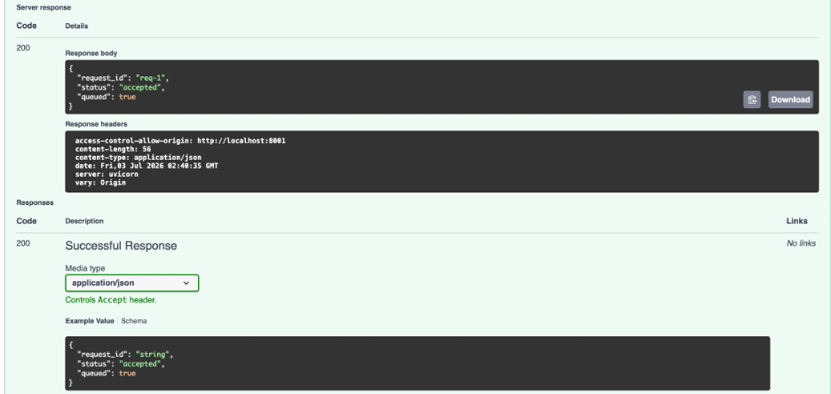
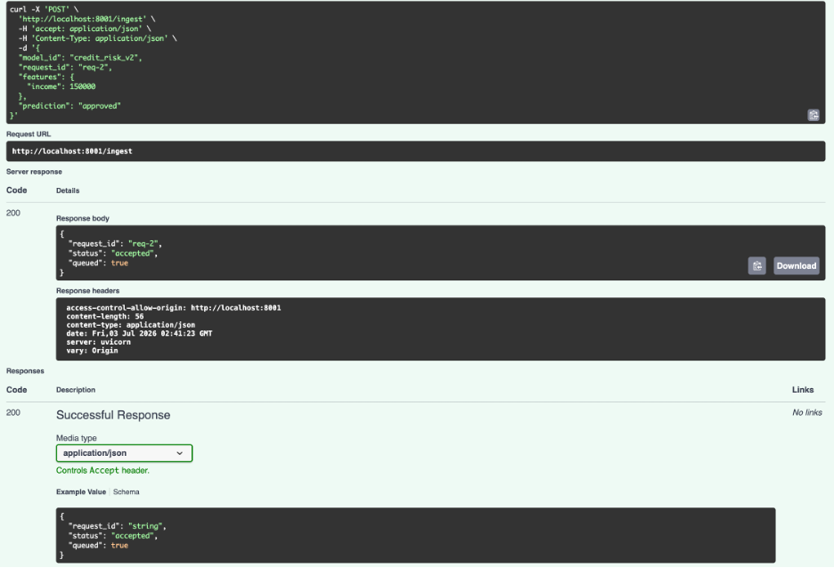
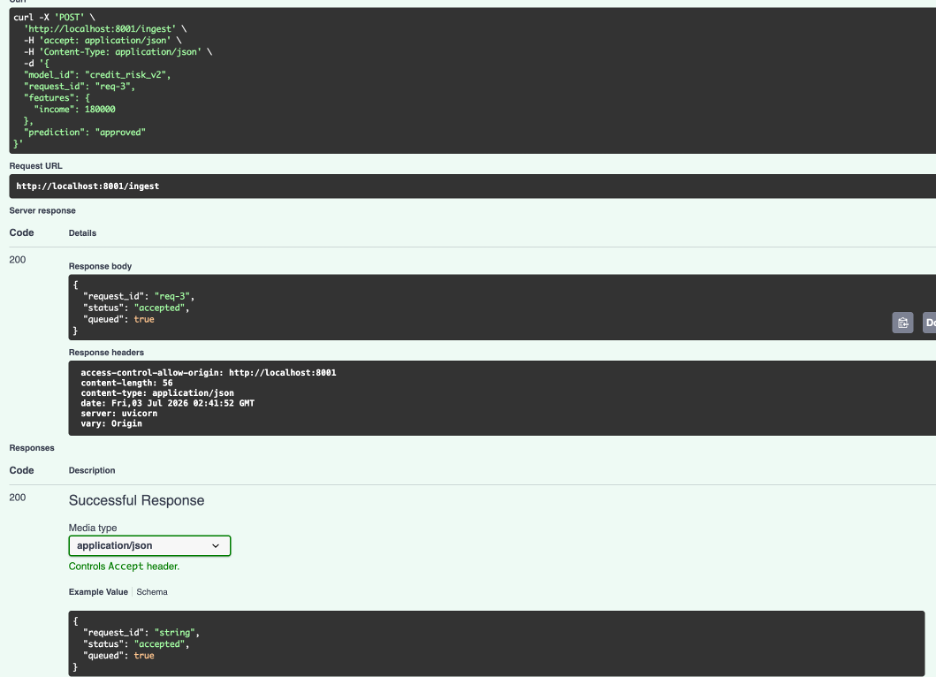
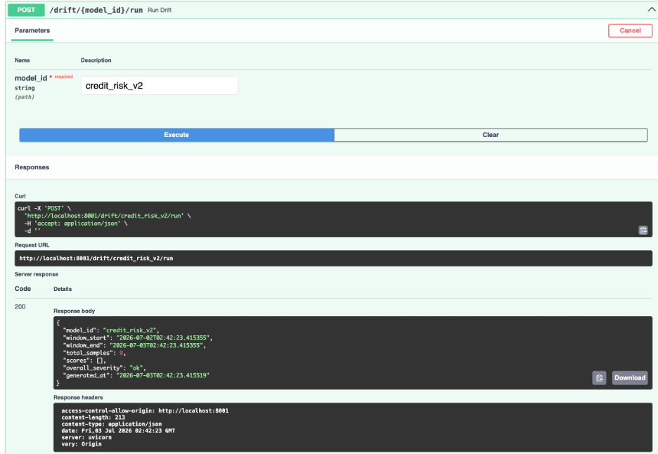

