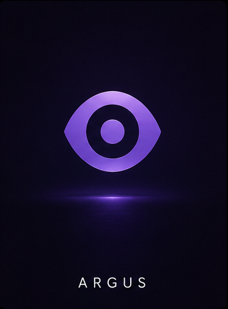
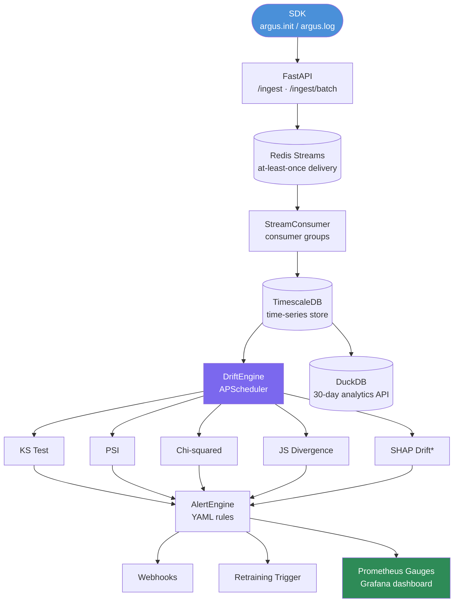

<p align="center">
  
</p>

<h1 align="center">Argus</h1>

<p align="center">
  <strong>ML Observability & Drift Detection Platform</strong>
</p>

<p align="center">
  Local-first model monitoring platform for prediction logging, drift detection,
  alerting, Prometheus metrics, and Grafana dashboards.
</p>

<p align="center">
  
  
  
  
  
</p>

---

## Overview

**Argus** is a local-first ML observability platform for deployed models.

It ingests feature vectors and predictions, stores prediction events, computes distribution drift against a reference baseline, fires configurable alerts, and exposes monitoring metrics through Prometheus and Grafana.

Argus is designed as the observability layer for ML systems that need to detect silent degradation before it reaches users or downstream business metrics.

---

## Why It Matters

Model degradation often happens silently. Input distributions shift, upstream data pipelines change, categorical values drift, and model assumptions become stale.

Without monitoring, teams usually discover the issue through user complaints, manual investigation, or degraded business metrics.

Argus implements the core production monitoring pattern:

* prediction event ingestion
* reference distribution management
* statistical drift computation
* alert rules
* retraining triggers
* time-series observability
* dashboard monitoring

---

## Architecture



*SHAP drift support is included as an experimental path. Verify implementation completeness before presenting it as a fully tested production feature.

---

## Features

* **Prediction ingestion API** for single and batch events
* **Python SDK** with `argus.init()` and `argus.log()`
* **Redis Streams pipeline** with consumer groups and at-least-once delivery
* **TimescaleDB storage** for timestamped drift scores and trend analysis
* **DuckDB analytics path** for local 30-day historical queries
* **Reference distribution management** through API
* **Drift detection methods** including KS test, PSI, Chi-squared, JS divergence, and experimental SHAP drift
* **YAML alert rules** with configurable thresholds, operators, and severities
* **Alert actions** through webhooks and retraining trigger signals
* **Prometheus metrics** for drift score, severity, alerts, ingestion, stream lag, and uptime
* **Grafana dashboard** for model monitoring

> **Note on SHAP drift:** KS test, PSI, Chi-squared, and JS divergence are the strongest methods to present in demos. Treat SHAP drift as experimental unless you have verified `argus_core/drift/shap_drift.py` and its tests.

---

## Tech Stack

| Area                | Tools                           |
| ------------------- | ------------------------------- |
| API                 | FastAPI                         |
| SDK                 | Python client                   |
| Stream Queue        | Redis Streams                   |
| Time-Series Storage | TimescaleDB                     |
| Analytics           | DuckDB                          |
| Scheduling          | APScheduler                     |
| Drift Methods       | SciPy, PSI, JS divergence, SHAP |
| Alerts              | YAML rules, webhooks            |
| Metrics             | Prometheus                      |
| Dashboard           | Grafana                         |
| Runtime             | Docker, Docker Compose          |

---

## Quickstart

### 1. Install dependencies

```bash id="3plwry"
cd argus
pip install -r requirements.txt
```

### 2. Start infrastructure

```bash id="8w90ne"
docker compose up timescaledb redis prometheus grafana -d
```

### 3. Start Argus

```bash id="s6i3p9"
uvicorn argus_core.main:app --port 8001 --reload
```

### 4. Run tests

```bash id="273tkk"
pytest tests/ -v
```

### 5. Run the synthetic drift demo

```bash id="e6be0d"
python demo/synthetic_drift_demo.py
```

### 6. Run the full Docker stack

```bash id="twqiz5"
docker compose up --build
```

---

## SDK Usage

```python id="ojf7cg"
import sdk as argus

argus.init(endpoint="http://localhost:8001", model_id="my_model")

prediction = model.predict(features)

argus.log(
    features=features,
    prediction=prediction,
    label=actual,
)
```

---

## API Endpoints

| Method | Endpoint                 | Description                                   |
| ------ | ------------------------ | --------------------------------------------- |
| POST   | `/models`                | Register a model and define features          |
| POST   | `/models/{id}/reference` | Set reference distribution for drift baseline |
| GET    | `/models`                | List registered models                        |
| GET    | `/models/{id}`           | Get model details                             |
| POST   | `/ingest`                | Log a single prediction                       |
| POST   | `/ingest/batch`          | Log prediction events in batch                |
| POST   | `/drift/{id}/run`        | Trigger drift computation immediately         |
| GET    | `/drift/{id}/latest`     | Get latest drift scores                       |
| GET    | `/health`                | Health check                                  |
| GET    | `/metrics`               | Prometheus metrics                            |
| GET    | `/docs`                  | Swagger interactive API docs                  |

---

## Example Usage

### Register a model

```bash id="gwii79"
curl -X POST http://localhost:8001/models \
  -H "Content-Type: application/json" \
  -d '{
    "model_id": "fraud_v1",
    "name": "Fraud Detector",
    "version": "1.0",
    "features": [
      {"name": "amount", "type": "numeric"},
      {"name": "merchant_type", "type": "categorical"}
    ]
  }'
```

### Ingest a prediction

```bash id="82nu1n"
curl -X POST http://localhost:8001/ingest \
  -H "Content-Type: application/json" \
  -d '{
    "model_id": "fraud_v1",
    "features": {"amount": 150.0, "merchant_type": "retail"},
    "prediction": 0
  }'
```

### Trigger drift computation

```bash id="6ynot2"
curl -X POST http://localhost:8001/drift/fraud_v1/run
```

### View latest drift scores

```bash id="6p7qfu"
curl http://localhost:8001/drift/fraud_v1/latest | python -m json.tool
```

---

## Alert Rules

Example `config/alert_rules.yaml`:

```yaml id="kfzmk9"
rules:
  - name: "psi_critical"
    method: "psi"
    threshold: 0.25
    operator: "gt"
    severity: "critical"
    retraining_trigger: true

  - name: "ks_warning"
    method: "ks_test"
    threshold: 0.1
    operator: "lt"
    severity: "warning"
```

Supported operators:

```text id="z3u0gm"
lt, gt, lte, gte
```

Supported methods:

```text id="1ur68m"
ks_test, psi, chi_squared, js_divergence, shap_drift
```

---

## Observability

Argus exposes Prometheus metrics at:

```text id="opz8i8"
http://localhost:8001/metrics
```

Grafana:

```text id="5a3751"
http://localhost:3000
```

Default login:

```text id="77f350"
admin / argus
```

Dashboard file:

```text id="tspxe7"
dashboards/argus_grafana.json
```

### Prometheus Metrics

| Metric                                                 | Description                        |
| ------------------------------------------------------ | ---------------------------------- |
| `argus_drift_score{model_id, feature_name, method}`    | Drift score per feature and method |
| `argus_drift_severity{model_id, feature_name}`         | Severity level from OK to critical |
| `argus_alerts_fired_total{model_id, severity, method}` | Alert fire count                   |
| `argus_ingest_total{model_id, status}`                 | Ingestion request count            |
| `argus_stream_consumer_lag`                            | Redis Streams consumer lag         |
| `argus_uptime_seconds`                                 | Server uptime                      |

### Drift Severity Thresholds

| Method                | OK     | Info     | Warning  | Critical |
| --------------------- | ------ | -------- | -------- | -------- |
| KS test p-value       | > 0.2  | 0.1–0.2  | 0.05–0.1 | < 0.05   |
| PSI                   | < 0.05 | 0.05–0.1 | 0.1–0.25 | > 0.25   |
| JS Divergence         | < 0.05 | 0.05–0.1 | 0.1–0.3  | > 0.3    |
| SHAP rank correlation | > 0.85 | 0.7–0.85 | 0.5–0.7  | < 0.5    |
| Chi-squared p-value   | > 0.1  | —        | 0.05–0.1 | < 0.05   |

---

## Demo

```bash id="fv9p62"
python demo/synthetic_drift_demo.py
```

The demo flow:

```text id="lmxt7r"
Registers a model
Sets a reference distribution
Ingests synthetic prediction events
Introduces distribution shift
Runs drift detection
Surfaces drift scores and alerts
```

Manual drift run:

```bash id="f2ksso"
curl -X POST http://localhost:8001/drift/fraud_v1/run
curl http://localhost:8001/drift/fraud_v1/latest | python -m json.tool
```

---

## Screenshots


---

## Tests

```bash id="m2w0v3"
pytest tests/ -v
```

With coverage:

```bash id="e8xiqb"
pytest tests/ -v --cov=argus_core
```

The test suite covers model registration, ingestion, drift computation, alert rules, SDK behavior, and API endpoints.

---

## Known Limitations

* **TimescaleDB dependency**: Argus uses TimescaleDB for time-series drift score storage, making it heavier than the DuckDB-only projects.
* **SHAP drift is experimental**: Verify implementation completeness before presenting it as fully tested.
* **Scheduled alert evaluation**: Alerts run on APScheduler intervals rather than sub-second streaming evaluation.
* **Single-tenant design**: Models share the same backend without team-level isolation.
* **No alert deduplication**: Repeated breaches may fire repeated alerts.
* **Reference distribution required**: Drift scores are only meaningful after a reference baseline has been set.

---

## Future Work

* Alert deduplication
* Slack and PagerDuty notification integrations
* DuckDB-first lightweight deployment mode
* Streaming drift detection
* Data quality checks for null rates and type mismatches
* Multi-tenant model registry with API key authentication
